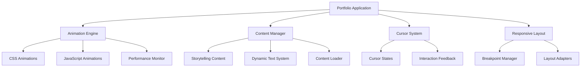

# Design Document: Premium Portfolio Redesign

## Overview

This design document outlines the architecture and implementation approach for transforming an existing HTML-based developer portfolio into a premium, animated, dark-themed professional experience. The design emphasizes performance-first animations, storytelling content architecture, custom cursor interactions, and component-based development patterns.

The solution leverages modern web technologies including CSS3 animations, JavaScript animation libraries, custom cursor systems, and responsive design principles to create a memorable personal brand experience while maintaining optimal performance across all devices. The architecture prioritizes maintainability through clear separation of concerns and reusable component patterns.

## Architecture

### High-Level Architecture

The portfolio system follows a modular, component-based architecture with clear separation of concerns:



### Technology Stack

**Core Technologies:**
- HTML5 with semantic markup
- CSS3 with custom properties and modern features
- Vanilla JavaScript (ES6+) for core functionality
- CSS Grid and Flexbox for layout systems

**Animation Framework:**
- Primary: CSS3 animations and transitions for performance
- Secondary: GSAP (GreenSock) for complex timeline animations
- Intersection Observer API for scroll-triggered animations
- Web Animations API for programmatic control

**Performance Optimization:**
- CSS `transform` and `opacity` properties for GPU acceleration
- `will-change` property for animation hints
- Passive event listeners for scroll performance
- Lazy loading for images and content sections

## Components and Interfaces

### Core Component Structure

#### 1. Animation Engine
```javascript
interface AnimationEngine {
  // Core animation management
  registerAnimation(element: Element, config: AnimationConfig): AnimationInstance
  playAnimation(id: string): Promise<void>
  pauseAnimation(id: string): void
  
  // Performance monitoring
  getFrameRate(): number
  isPerformanceOptimal(): boolean
  
  // Scroll-based animations
  registerScrollTrigger(element: Element, config: ScrollConfig): void
}

interface AnimationConfig {
  duration: number
  easing: string
  delay?: number
  properties: AnimationProperty[]
  performanceMode: 'gpu' | 'cpu' | 'auto'
}
```

#### 2. Cursor System
```javascript
interface CursorSystem {
  // Cursor state management
  setCursorState(state: CursorState): void
  registerHoverTarget(element: Element, config: HoverConfig): void
  
  // Custom cursor rendering
  updateCursorPosition(x: number, y: number): void
  showCursorTrail(enabled: boolean): void
}

interface CursorState {
  type: 'default' | 'hover' | 'click' | 'drag' | 'text'
  size: number
  color: string
  animation?: string
}
```

#### 3. Content Manager
```javascript
interface ContentManager {
  // Content loading and management
  loadSection(sectionId: string): Promise<ContentSection>
  updateContent(sectionId: string, content: ContentData): void
  
  // Storytelling features
  animateTextReveal(element: Element, config: TextRevealConfig): void
  createNarrativeFlow(sections: ContentSection[]): void
}

interface ContentSection {
  id: string
  title: string
  content: string
  animations: AnimationConfig[]
  storytellingMode: boolean
}
```

#### 5. Navigation and Scrolling System
```javascript
interface NavigationSystem {
  // Smooth scrolling management
  scrollToSection(sectionId: string, options?: ScrollOptions): Promise<void>
  getCurrentSection(): string
  
  // Section navigation
  showSectionIndicator(visible: boolean): void
  updateProgressIndicator(progress: number): void
  
  // Scroll position management
  saveScrollPosition(): void
  restoreScrollPosition(): void
  getScrollHistory(): ScrollHistoryEntry[]
}

interface ScrollOptions {
  duration: number
  easing: string
  offset?: number
  callback?: () => void
}
```

#### 6. Loading and Micro-interaction Manager
```javascript
interface LoadingManager {
  // Loading state management
  showLoadingState(element: Element, type: LoadingType): void
  hideLoadingState(element: Element): void
  
  // Micro-interaction coordination
  registerMicroInteraction(element: Element, config: MicroInteractionConfig): void
  triggerInteractionFeedback(element: Element, type: InteractionType): void
}

interface MicroInteractionConfig {
  hover?: AnimationConfig
  click?: AnimationConfig
  focus?: AnimationConfig
  completion?: AnimationConfig
}

type LoadingType = 'skeleton' | 'spinner' | 'progressive' | 'placeholder'
type InteractionType = 'hover' | 'click' | 'focus' | 'success' | 'error'
```
#### 7. Responsive Layout Manager
```javascript
interface ResponsiveLayout {
  // Breakpoint management
  getCurrentBreakpoint(): Breakpoint
  onBreakpointChange(callback: (breakpoint: Breakpoint) => void): void
  
  // Layout adaptation
  adaptLayout(breakpoint: Breakpoint): void
  optimizeAnimationsForDevice(): void
  
  // Touch interaction optimization
  enableTouchOptimizations(): void
  setTouchTargetSizes(minSize: number): void
}

type Breakpoint = 'mobile' | 'tablet' | 'desktop' | 'large-desktop'
```

### Section Components

#### 1. Hero Section
- Animated introduction with typewriter effect and storytelling narrative
- Performance-optimized particle background system
- Smooth scroll indicator with custom styling
- Custom cursor integration with state management
- Engaging loading animations and micro-interactions

#### 2. About Section
- Storytelling content with progressive reveal animations
- Interactive timeline of experience with narrative flow
- Skill visualization with contextual storytelling approach
- Personal brand elements with professional tone
- Scannable content structure despite narrative format

#### 3. Skills Section
- Interactive technology grid with visual proficiency indicators
- Category-based filtering with smooth transitions
- Progressive animation system for skill reveals
- Hover states with detailed information displays
- Logical technology grouping with contextual storytelling

#### 4. Projects Section
- Card-based layout with rich visual previews
- Interactive project previews on hover
- Clear project categorization and organization
- Modal system for detailed project views
- Smooth transitions between project navigation

#### 5. Contact Section
- Multiple engagement options and contact methods
- Interactive contact form with rich feedback
- Creative call-to-action elements
- Professional yet approachable interaction design
- Easy access to contact information

#### 6. Resume Download Section
- Creative download interaction with unique animations
- Multiple format accessibility (PDF, HTML)
- Clear download confirmation and feedback system
- Post-download engagement options
- Professional credibility maintenance throughout process

## Data Models

### Performance and Loading Strategy

#### Loading Performance Requirements
The portfolio system must meet specific performance standards across different devices and network conditions:

**Performance Budgets:**
- **Desktop (Broadband)**: Initial load < 1 second, complete render < 2 seconds
- **Mobile (3G)**: Initial load < 3 seconds, complete render < 5 seconds
- **Animation Performance**: Maintain 60fps across all animations
- **Memory Usage**: < 50MB total memory footprint
- **Bundle Size**: < 500KB initial JavaScript bundle

**Loading Strategy Design Decisions:**

1. **Progressive Loading Architecture**: Content loads in priority order - hero first, then above-the-fold content, followed by below-the-fold sections
   - *Rationale*: Ensures immediate user engagement while background content loads

2. **Adaptive Performance**: Animation complexity reduces automatically on lower-end devices
   - *Rationale*: Maintains smooth experience across device capabilities

3. **Lazy Loading Implementation**: Images and heavy content load only when approaching viewport
   - *Rationale*: Reduces initial load time and bandwidth usage

4. **Skeleton Loading States**: Meaningful loading animations provide feedback during wait times
   - *Rationale*: Improves perceived performance and user experience

#### Loading State Management
```javascript
interface LoadingStateManager {
  // Progressive loading coordination
  initializeProgressiveLoad(): Promise<void>
  loadSection(sectionId: string, priority: LoadPriority): Promise<void>
  
  // Performance monitoring
  monitorLoadingPerformance(): PerformanceMetrics
  adaptToDeviceCapabilities(deviceInfo: DeviceCapabilities): void
  
  // User feedback
  showSkeletonLoader(element: Element, config: SkeletonConfig): void
  updateLoadingProgress(percentage: number): void
}

interface SkeletonConfig {
  type: 'text' | 'image' | 'card' | 'custom'
  animationType: 'pulse' | 'wave' | 'fade'
  duration: number
}

type LoadPriority = 'critical' | 'high' | 'medium' | 'low'
```

### Animation Data Structure

#### Design Philosophy and Rationale
The premium dark theme serves multiple strategic purposes beyond aesthetic appeal:

1. **Professional Sophistication**: Dark themes convey technical expertise and modern design sensibility
2. **Content Focus**: Reduced visual noise allows portfolio content to take center stage
3. **Eye Comfort**: Reduced eye strain during extended viewing sessions
4. **Brand Differentiation**: Distinctive visual identity in a sea of light-themed portfolios
5. **Performance Benefits**: Dark pixels consume less energy on OLED displays

### Animation Data Structure
```javascript
interface AnimationData {
  id: string
  element: string | Element
  keyframes: Keyframe[]
  options: {
    duration: number
    easing: string
    delay: number
    iterations: number
    fill: 'forwards' | 'backwards' | 'both' | 'none'
  }
  triggers: {
    scroll?: ScrollTrigger
    hover?: boolean
    click?: boolean
    intersection?: IntersectionConfig
  }
  performance: {
    useGPU: boolean
    priority: 'high' | 'medium' | 'low'
    fallback?: AnimationData
  }
}

interface ScrollTrigger {
  start: string | number
  end: string | number
  scrub: boolean
  pin?: boolean
}
```

### Content Data Structure
```javascript
interface PortfolioContent {
  hero: {
    title: string
    subtitle: string
    description: string
    callToAction: string
    narrative: string[]  // Storytelling elements
  }
  about: {
    story: string[]  // Narrative flow content
    highlights: string[]
    timeline: TimelineEntry[]  // Interactive experience timeline
    personalBrand: {
      values: string[]
      approach: string
      narrative: string  // Storytelling approach
    }
  }
  skills: {
    categories: SkillCategory[]
    featured: string[]
    narrativeContext: string  // Contextual storytelling for skills
    proficiencyLevels: ProficiencyLevel[]
  }
  projects: {
    featured: Project[]
    categories: string[]
    showcaseOrder: string[]  // Order for smooth transitions
  }
  contact: {
    methods: ContactMethod[]
    availability: string
    engagementOptions: EngagementOption[]  // Multiple engagement types
    resume: {
      url: string
      formats: ResumeFormat[]  // Multiple accessible formats
      lastUpdated: Date
      downloadExperience: DownloadExperienceConfig
    }
  }
}

interface TimelineEntry {
  id: string
  date: string
  title: string
  description: string
  narrative: string  // Storytelling content
  type: 'education' | 'experience' | 'achievement'
}

interface ProficiencyLevel {
  skill: string
  level: number  // 1-10 scale
  visualRepresentation: 'bar' | 'circle' | 'stars' | 'custom'
  context: string  // Storytelling context
}

interface EngagementOption {
  type: 'email' | 'social' | 'calendar' | 'form'
  label: string
  url?: string
  icon: string
  priority: number
}

interface ResumeFormat {
  type: 'pdf' | 'html' | 'doc'
  url: string
  accessibility: AccessibilityFeatures
}

interface DownloadExperienceConfig {
  animation: AnimationConfig
  confirmationMessage: string
  postDownloadOptions: EngagementOption[]
}

interface Project {
  id: string
  title: string
  description: string
  story: string  // Narrative storytelling content
  technologies: string[]
  images: string[]
  previewConfig: ProjectPreviewConfig  // Rich visual preview settings
  links: {
    live?: string
    github?: string
    case_study?: string
  }
  featured: boolean
  category: string
  showcaseOrder: number  // For smooth transition ordering
}

interface ProjectPreviewConfig {
  hoverAnimation: AnimationConfig
  previewType: 'image' | 'video' | 'interactive'
  previewContent: string
  transitionDuration: number
}
```

### Dark-Themed Visual System

#### Design Philosophy and Rationale
The premium dark theme serves multiple strategic purposes beyond aesthetic appeal:

1. **Professional Sophistication**: Dark themes convey technical expertise and modern design sensibility
2. **Content Focus**: Reduced visual noise allows portfolio content to take center stage
3. **Eye Comfort**: Reduced eye strain during extended viewing sessions
4. **Brand Differentiation**: Distinctive visual identity in a sea of light-themed portfolios
5. **Performance Benefits**: Dark pixels consume less energy on OLED displays

#### Color Palette Design
The premium dark theme creates a sophisticated, calm, and professional atmosphere:

**Primary Colors:**
- **Deep Charcoal**: `#0a0a0b` - Primary background, creates depth
- **Rich Graphite**: `#1a1a1d` - Secondary surfaces, subtle elevation
- **Warm Slate**: `#2d2d32` - Interactive surfaces, gentle contrast

**Accent Colors:**
- **Electric Blue**: `#00d4ff` - Primary accent, modern and energetic
- **Soft Cyan**: `#4dd0e1` - Secondary accent, approachable highlight
- **Muted Gold**: `#ffd54f` - Tertiary accent, premium warmth

**Text Colors:**
- **Pure White**: `#ffffff` - Primary text, maximum readability
- **Light Gray**: `#e0e0e0` - Secondary text, reduced emphasis
- **Medium Gray**: `#9e9e9e` - Tertiary text, subtle information
- **Accent Text**: `#00d4ff` - Links and interactive text

**Background Gradients:**
- **Hero Gradient**: `linear-gradient(135deg, #0a0a0b 0%, #1a1a1d 100%)`
- **Section Gradient**: `radial-gradient(ellipse at center, #1a1a1d 0%, #0a0a0b 100%)`
- **Interactive Gradient**: `linear-gradient(45deg, #2d2d32 0%, #1a1a1d 100%)`

#### Typography Philosophy
Typography enhances the premium feel through careful font selection and hierarchy:

**Font Personality:**
- **Primary Font**: Inter (clean, modern, highly readable)
- **Display Font**: Playfair Display (elegant, sophisticated for headings)
- **Monospace Font**: JetBrains Mono (technical content, code snippets)

**Weight Usage:**
- **Light (300)**: Large display text, elegant presence
- **Regular (400)**: Body text, comfortable reading
- **Medium (500)**: Subheadings, emphasis
- **SemiBold (600)**: Section headings, strong hierarchy
- **Bold (700)**: Primary headings, maximum impact

**Type Scale:**
- **Display**: 4rem (64px) - Hero titles
- **H1**: 3rem (48px) - Section headings
- **H2**: 2.25rem (36px) - Subsection headings
- **H3**: 1.5rem (24px) - Component headings
- **Body**: 1rem (16px) - Primary text
- **Small**: 0.875rem (14px) - Secondary text
- **Caption**: 0.75rem (12px) - Metadata, labels

#### Spacing and Layout Philosophy
The layout system creates breathing room and visual hierarchy:

**Spacing Scale (8px base unit):**
- **xs**: 4px - Tight spacing, inline elements
- **sm**: 8px - Close relationships
- **md**: 16px - Standard component spacing
- **lg**: 24px - Section spacing
- **xl**: 32px - Major section breaks
- **2xl**: 48px - Page-level spacing
- **3xl**: 64px - Hero-level spacing

**Layout Principles:**
- **Generous White Space**: Creates premium, uncluttered feel
- **Asymmetrical Balance**: Dynamic layouts that feel intentional
- **Progressive Disclosure**: Information revealed as needed
- **Consistent Rhythm**: Predictable spacing patterns

### Animation Philosophy

#### Core Animation Principles
Animations should feel elegant, intentional, and enhance user understanding:

**When Animations Should Occur:**
1. **Page Entry**: Welcome users with purposeful entrance animations
2. **Content Reveal**: Progressive disclosure as users scroll
3. **User Interaction**: Immediate feedback for all interactive elements
4. **State Changes**: Smooth transitions between different states
5. **Navigation**: Seamless movement between sections
6. **Loading States**: Engaging feedback during wait times

**Animation Types and Usage:**

**Fade Animations:**
- **Fade In**: Content appearing (opacity: 0 → 1)
- **Fade Out**: Content disappearing (opacity: 1 → 0)
- **Cross Fade**: Transitioning between content states
- *Usage*: Text reveals, image loading, subtle state changes

**Slide Animations:**
- **Slide Up**: Content entering from below (translateY: 20px → 0)
- **Slide Down**: Content entering from above (translateY: -20px → 0)
- **Slide Left/Right**: Horizontal content transitions
- *Usage*: Card reveals, navigation, content sections

**Reveal Animations:**
- **Clip Path**: Geometric reveals using CSS clip-path
- **Mask Reveals**: Content appearing through animated masks
- **Stagger Reveals**: Sequential animation of multiple elements
- *Usage*: Hero text, skill items, project showcases

**Morph Animations:**
- **Shape Morphing**: SVG path transformations
- **Size Morphing**: Scale transformations with easing
- **Color Morphing**: Smooth color transitions
- *Usage*: Icons, buttons, interactive elements

#### Motion Timing and Easing

**Duration Guidelines:**
- **Micro-interactions**: 150-200ms (button hovers, small state changes)
- **Standard Transitions**: 300-400ms (content reveals, navigation)
- **Complex Animations**: 600-800ms (page transitions, major state changes)
- **Ambient Animations**: 2-4s (background elements, breathing effects)

**Easing Functions:**
- **Ease-out**: `cubic-bezier(0.25, 0.46, 0.45, 0.94)` - Natural deceleration
- **Ease-in-out**: `cubic-bezier(0.42, 0, 0.58, 1)` - Smooth acceleration/deceleration
- **Bounce**: `cubic-bezier(0.68, -0.55, 0.265, 1.55)` - Playful overshoot
- **Elastic**: Custom spring physics for organic movement

#### Rules to Avoid Over-Animation

**The "Less is More" Principle:**
1. **One Animation at a Time**: Avoid competing animations
2. **Purposeful Motion**: Every animation should have a clear purpose
3. **Respect User Preferences**: Honor prefers-reduced-motion settings
4. **Performance First**: Never sacrifice performance for visual flair
5. **Content Priority**: Animations should enhance, not distract from content

**Animation Hierarchy:**
- **Primary**: Critical user feedback (clicks, form submissions)
- **Secondary**: Content reveals and navigation
- **Tertiary**: Ambient effects and micro-interactions
- **Disabled**: When performance drops or user preferences indicate

### MCP Context Requirements

#### UI Component Structure Context
The system should maintain context about:
- Component hierarchy and relationships
- Reusable component patterns and variations
- Component state management and data flow
- Responsive behavior patterns across components

#### Animation Logic and Dependencies Context
Track and maintain:
- Animation sequences and their dependencies
- Performance optimization strategies per animation type
- Cross-component animation coordination
- Fallback strategies for different device capabilities

#### Design Token Context
Maintain comprehensive design system context:
- Color palette with semantic naming and usage rules
- Typography scale with appropriate use cases
- Spacing system with consistent application patterns
- Animation timing and easing function library

#### Custom Cursor Behavior Context
Store cursor interaction patterns:
- Cursor state definitions and trigger conditions
- Device-specific cursor behavior adaptations
- Performance optimization for cursor tracking
- Accessibility considerations for cursor interactions

#### Resume Download Flow Context
Maintain download experience context:
- Creative interaction patterns and animations
- File format options and accessibility requirements
- User feedback and confirmation patterns
- Post-download engagement strategies

#### Accessibility Constraints Context
Track accessibility requirements:
- WCAG compliance standards and testing methods
- Motion preference handling strategies
- Color contrast validation rules
- Keyboard navigation patterns

### Theme Data Structure
```javascript
interface ThemeConfig {
  colors: {
    primary: {
      deepCharcoal: '#0a0a0b',
      richGraphite: '#1a1a1d',
      warmSlate: '#2d2d32'
    },
    accent: {
      electricBlue: '#00d4ff',
      softCyan: '#4dd0e1',
      mutedGold: '#ffd54f'
    },
    text: {
      primary: '#ffffff',
      secondary: '#e0e0e0',
      tertiary: '#9e9e9e',
      accent: '#00d4ff'
    },
    gradients: {
      hero: 'linear-gradient(135deg, #0a0a0b 0%, #1a1a1d 100%)',
      section: 'radial-gradient(ellipse at center, #1a1a1d 0%, #0a0a0b 100%)',
      interactive: 'linear-gradient(45deg, #2d2d32 0%, #1a1a1d 100%)'
    }
  },
  typography: {
    fonts: {
      primary: 'Inter, system-ui, sans-serif',
      display: 'Playfair Display, serif',
      mono: 'JetBrains Mono, monospace'
    },
    weights: {
      light: 300,
      regular: 400,
      medium: 500,
      semibold: 600,
      bold: 700
    },
    scale: {
      display: '4rem',
      h1: '3rem',
      h2: '2.25rem',
      h3: '1.5rem',
      body: '1rem',
      small: '0.875rem',
      caption: '0.75rem'
    }
  },
  spacing: {
    xs: '4px',
    sm: '8px',
    md: '16px',
    lg: '24px',
    xl: '32px',
    '2xl': '48px',
    '3xl': '64px'
  },
  animations: {
    durations: {
      micro: 150,
      fast: 300,
      normal: 400,
      slow: 600,
      ambient: 2000
    },
    easings: {
      easeOut: 'cubic-bezier(0.25, 0.46, 0.45, 0.94)',
      easeInOut: 'cubic-bezier(0.42, 0, 0.58, 1)',
      bounce: 'cubic-bezier(0.68, -0.55, 0.265, 1.55)',
      elastic: 'cubic-bezier(0.175, 0.885, 0.32, 1.275)'
    }
  }
}
```

## Correctness Properties

*A property is a characteristic or behavior that should hold true across all valid executions of a system—essentially, a formal statement about what the system should do. Properties serve as the bridge between human-readable specifications and machine-verifiable correctness guarantees.*

Before defining the correctness properties, I need to analyze the acceptance criteria from the requirements document to determine which ones are testable as properties.

### Property Reflection

After analyzing all acceptance criteria, I identified several areas where properties can be consolidated to eliminate redundancy:

**Performance Properties**: Multiple criteria test animation performance (2.1, 2.6, 8.3, 12.5) - these can be combined into comprehensive performance properties.

**Smooth Transitions**: Several criteria test smooth transitions (2.4, 6.1, 12.1) - these can be unified into transition performance properties.

**Interactive Feedback**: Multiple criteria test interaction feedback (3.1, 9.2, 11.3) - these can be combined into comprehensive interaction properties.

**Content Structure**: Several criteria test content organization (4.1, 4.4, 6.4) - these can be unified into content structure properties.

**Responsive Behavior**: Multiple criteria test responsive adaptation (8.1, 8.2, 8.5) - these can be combined into comprehensive responsive properties.

### Correctness Properties

Property 1: **Dark Theme Consistency**
*For any* component or page element in the portfolio system, all color values should fall within the defined dark palette ranges and maintain consistent theming
**Validates: Requirements 1.1, 1.2**

Property 2: **Accessibility Contrast Compliance**
*For any* text and background color combination, the contrast ratio should meet or exceed WCAG AA standards (4.5:1 for normal text, 3:1 for large text)
**Validates: Requirements 1.3**

Property 3: **Animation Performance Budget**
*For any* animation in the system, execution should complete within the allocated performance budget (16.67ms per frame) and maintain 60fps
**Validates: Requirements 2.1, 2.6, 8.3, 12.5**

Property 4: **Entrance Animation Smoothness**
*For any* page element that loads, entrance animations should complete without frame drops and within specified duration limits
**Validates: Requirements 2.3**

Property 5: **Motion Preference Respect**
*For any* user with prefers-reduced-motion enabled, animations should be disabled or reduced to respect accessibility preferences
**Validates: Requirements 2.5**

Property 6: **Cursor State Consistency**
*For any* interactive element type, hovering should trigger the appropriate cursor state change consistently across all instances
**Validates: Requirements 3.1, 3.2**

Property 7: **Cursor Response Performance**
*For any* cursor movement, the visual response should occur within 16ms to maintain smooth tracking
**Validates: Requirements 3.3**

Property 8: **Cross-Device Cursor Functionality**
*For any* supported device type, cursor interactions should function properly with appropriate fallbacks for touch devices
**Validates: Requirements 3.4**

Property 9: **Storytelling Content Structure**
*For any* content section, information should be presented in narrative format with contextual flow rather than plain lists
**Validates: Requirements 4.1, 4.2, 4.4**

Property 10: **Content Scannability**
*For any* content section, despite narrative approach, structure should include scannable elements (headings, paragraphs, white space)
**Validates: Requirements 4.5**

Property 11: **Interactive Skills Display**
*For any* skill or technology item, interactive behaviors (hover, click) should be present and provide detailed information
**Validates: Requirements 5.1, 5.3**

Property 12: **Visual Skill Proficiency**
*For any* skill listed, a visual proficiency indicator should be present and accurately represent the skill level
**Validates: Requirements 5.2**

Property 13: **Progressive Skills Animation**
*For any* skills section load, individual skills should animate in with staggered timing rather than simultaneously
**Validates: Requirements 5.5**

Property 14: **Smooth Transition Performance**
*For any* navigation between sections or projects, transitions should maintain 60fps performance and complete within specified duration
**Validates: Requirements 2.4, 6.1, 12.1**

Property 15: **Project Visual Previews**
*For any* project in the showcase, rich visual preview elements should be present and display on hover interactions
**Validates: Requirements 6.2, 6.3**

Property 16: **Project Categorization**
*For any* project displayed, it should belong to a clearly defined category and be grouped logically with similar projects
**Validates: Requirements 6.4**

Property 17: **Download Confirmation Feedback**
*For any* resume download action, clear confirmation messages and visual feedback should be provided to the user
**Validates: Requirements 7.3**

Property 18: **Post-Download Engagement**
*For any* successful download completion, additional engagement options should be presented to the user
**Validates: Requirements 7.4**

Property 19: **Resume Format Accessibility**
*For any* resume download request, the resume should be available in multiple accessible formats (PDF, HTML, etc.)
**Validates: Requirements 7.5**

Property 20: **Responsive Layout Adaptation**
*For any* viewport size change across mobile, tablet, and desktop breakpoints, layout should adapt smoothly while maintaining design integrity
**Validates: Requirements 8.1, 8.2**

Property 21: **Loading Performance Standards**
*For any* device type and network condition, initial page load should complete within acceptable time limits (3s on 3G, 1s on broadband)
**Validates: Requirements 8.4**

Property 22: **Touch Interaction Optimization**
*For any* mobile device interaction, touch targets should be appropriately sized (minimum 44px) and touch interactions should work properly
**Validates: Requirements 8.5**

Property 23: **Loading State Presence**
*For any* content loading period, meaningful loading animations or states should be displayed to provide user feedback
**Validates: Requirements 9.1, 9.3**

Property 24: **Micro-interaction Coverage**
*For any* interactive element, associated micro-interactions should be present and complete within performance budgets
**Validates: Requirements 9.2, 9.4**

Property 25: **Interaction Completion Feedback**
*For any* completed user interaction, clear visual feedback should be provided to confirm the action
**Validates: Requirements 9.5**

Property 26: **Architecture Separation**
*For any* component in the system, animation logic should be separated from layout structure in distinct modules
**Validates: Requirements 10.1, 10.4**

Property 27: **Component Reusability**
*For any* component pattern, it should be reusable across different contexts and follow consistent API patterns
**Validates: Requirements 10.2, 10.5**

Property 28: **Content Update Independence**
*For any* content update, existing animations should continue to function without requiring modification
**Validates: Requirements 10.3**

Property 29: **Contact Engagement Options**
*For any* contact section view, multiple engagement methods should be available and easily accessible
**Validates: Requirements 11.1, 11.2**

Property 30: **Contact Interaction Feedback**
*For any* contact element interaction, rich feedback responses should be provided to enhance user experience
**Validates: Requirements 11.3**

Property 31: **Section Navigation Clarity**
*For any* portfolio navigation, clear section indicators and progress indication should be present and functional
**Validates: Requirements 12.2**

Property 32: **Smooth Section Jumping**
*For any* section navigation action, smooth scroll animations should transport users to target areas
**Validates: Requirements 12.3**

Property 33: **Scroll Context Preservation**
*For any* scroll interaction, position context should be tracked and restorable for user navigation history
**Validates: Requirements 12.4**

## Error Handling

### Animation Error Handling

**Performance Degradation:**
- Monitor frame rate during animations
- Automatically reduce animation complexity if performance drops below 45fps
- Provide fallback static states for critical content
- Log performance issues for debugging

**Browser Compatibility:**
- Detect animation support capabilities
- Provide CSS-only fallbacks for unsupported features
- Graceful degradation for older browsers
- Feature detection for advanced animation APIs

**Resource Loading Failures:**
- Handle missing animation assets gracefully
- Provide placeholder animations for failed resources
- Retry mechanisms for network-dependent animations
- Clear error messages for development debugging

### Content Loading Error Handling

**Network Failures:**
- Implement retry logic with exponential backoff
- Cache critical content for offline scenarios
- Display meaningful error messages to users
- Provide manual refresh options

**Content Validation:**
- Validate content structure before rendering
- Handle malformed or missing content gracefully
- Provide default content for missing sections
- Log content errors for debugging

### User Interaction Error Handling

**Input Validation:**
- Validate all user inputs before processing
- Provide clear feedback for invalid inputs
- Handle edge cases in form submissions
- Sanitize user-generated content

**Device Compatibility:**
- Detect device capabilities and limitations
- Provide appropriate fallbacks for unsupported features
- Handle touch vs. mouse interaction differences
- Adapt to various screen sizes and orientations

## Testing Strategy

### Dual Testing Approach

The portfolio system requires both unit testing and property-based testing to ensure comprehensive coverage:

**Unit Tests:**
- Focus on specific examples and edge cases
- Test individual component functionality
- Validate error conditions and boundary cases
- Ensure integration points work correctly
- Test specific user interaction scenarios

**Property-Based Tests:**
- Verify universal properties across all inputs
- Test animation performance with random parameters
- Validate responsive behavior across viewport ranges
- Ensure accessibility compliance across all content
- Test content structure consistency

### Property-Based Testing Configuration

**Framework Selection:**
- Primary: fast-check for JavaScript property-based testing
- Animation testing: Custom performance measurement utilities
- Accessibility testing: axe-core for automated accessibility validation
- Visual regression: Playwright for cross-browser testing

**Test Configuration:**
- Minimum 100 iterations per property test
- Each property test references its design document property
- Tag format: **Feature: premium-portfolio-redesign, Property {number}: {property_text}**
- Performance tests run with realistic device constraints
- Accessibility tests cover all WCAG AA requirements

**Example Property Test Structure:**
```javascript
// Feature: premium-portfolio-redesign, Property 3: Animation Performance Budget
test('animations maintain 60fps performance', () => {
  fc.assert(fc.property(
    fc.record({
      duration: fc.integer(100, 2000),
      elements: fc.array(fc.string(), 1, 10),
      complexity: fc.integer(1, 5)
    }),
    (animationConfig) => {
      const animation = createAnimation(animationConfig);
      const frameRate = measureFrameRate(animation);
      return frameRate >= 60;
    }
  ), { numRuns: 100 });
});
```

### Testing Categories

**Performance Testing:**
- Animation frame rate monitoring
- Loading time validation across devices
- Memory usage during complex animations
- CPU usage optimization verification

**Accessibility Testing:**
- Color contrast ratio validation
- Keyboard navigation functionality
- Screen reader compatibility
- Motion preference respect

**Responsive Testing:**
- Layout adaptation across breakpoints
- Touch interaction optimization
- Content readability on all devices
- Performance on various device capabilities

**Content Testing:**
- Storytelling structure validation
- Content loading and error handling
- Dynamic content updates
- Multilingual support (if applicable)

**Integration Testing:**
- Component interaction validation
- Animation coordination between sections
- Cursor system integration
- Performance monitoring integration

This comprehensive testing strategy ensures that the premium portfolio redesign meets all requirements while maintaining optimal performance and accessibility across all supported devices and user scenarios.

## Key Design Decisions and Rationales

### 1. Component-Based Architecture Decision
**Decision**: Implement a modular, component-based architecture with clear separation of concerns
**Rationale**: This approach ensures maintainability (Requirement 10), allows for independent content updates (Requirement 10.3), and enables reusable patterns across the portfolio (Requirement 10.2, 10.5)

### 2. Performance-First Animation Strategy
**Decision**: Prioritize CSS3 animations with GPU acceleration over JavaScript-heavy solutions
**Rationale**: Ensures 60fps performance across devices (Requirement 2.6), maintains smooth transitions (Requirement 2.4), and provides better battery life on mobile devices (Requirement 8.3)

### 3. Storytelling Content Architecture
**Decision**: Structure content as narrative flows rather than traditional bullet-point lists
**Rationale**: Creates emotional connection with visitors (Requirement 4.1, 4.2), maintains professional credibility while being engaging (Requirement 4.3), and differentiates from typical developer portfolios

### 4. Custom Cursor System Implementation
**Decision**: Build a custom cursor system with multiple interaction states
**Rationale**: Provides unique user experience (Requirement 3.1, 3.2), enhances rather than hinders usability (Requirement 3.5), and creates memorable brand interaction

### 5. Progressive Loading Strategy
**Decision**: Implement priority-based content loading with skeleton states
**Rationale**: Ensures fast initial load times (Requirement 8.4), provides meaningful feedback during loading (Requirement 9.1, 9.3), and maintains engagement during wait times

### 6. Dark Theme Color Psychology
**Decision**: Use deep charcoal backgrounds with electric blue accents
**Rationale**: Conveys technical sophistication (Requirement 1.1), reduces eye strain for extended viewing, and creates premium brand perception while maintaining accessibility compliance (Requirement 1.3)

### 7. Dual Testing Approach
**Decision**: Combine unit testing with property-based testing
**Rationale**: Unit tests validate specific scenarios while property-based tests ensure universal correctness across all possible inputs, providing comprehensive coverage for complex animation and interaction systems

### 8. Touch-First Responsive Design
**Decision**: Design for mobile first, then enhance for larger screens
**Rationale**: Ensures optimal mobile experience (Requirement 8.5), maintains performance on resource-constrained devices (Requirement 8.3), and follows modern web development best practices

These design decisions collectively create a cohesive system that balances visual appeal, technical performance, and user experience while meeting all specified requirements.